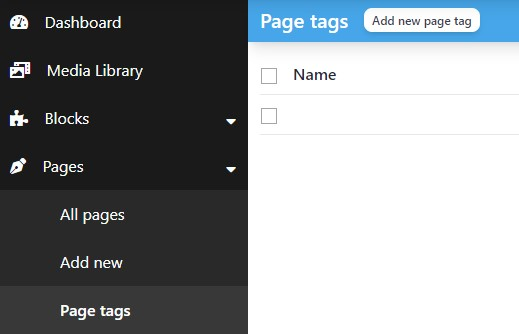

# Create a taxonomy

You may want to add some taxonomies to your custom content types or to built-in content types.
This is done simply by creating fixtures.


## Add a fixture

As an example we'll create a `Tag` taxonomy for `page` content type, which doesn't have taxonomies by default.

Create a class in `src/DataFixtures/TaxonomyFixtures.php` file.

```php
namespace App\DataFixtures;

use Doctrine\Bundle\FixturesBundle\Fixture;
use Doctrine\Bundle\FixturesBundle\FixtureGroupInterface;
use Doctrine\Persistence\ObjectManager;
use NumberNine\Entity\Taxonomy;
use NumberNine\Repository\TaxonomyRepository;

final class TaxonomyFixtures extends Fixture implements FixtureGroupInterface
{
    public function __construct(private readonly TaxonomyRepository $taxonomyRepository)
    {
    }

    public function load(ObjectManager $manager): void
    {
        $this->createPageTag($manager);
        $manager->flush();
    }

    private function createPageTag(ObjectManager $manager): void
    {
        if ($this->taxonomyRepository->findOneByName('page_tag')) {
            return;
        }

        $taxonomy = (new Taxonomy())
            ->setName('page_tag')
            ->setContentTypes(['page'])
        ;

        $manager->persist($taxonomy);
    }

    public static function getGroups(): array
    {
        return ['app'];
    }
}
```

The new taxonomies will be automatically created at project installation.

To manually load them on an existing project, run the command below.

```bash
docker compose exec php bin/console doctrine:fixtures:load --append --group=app
```

::: tip
If you're not using Docker, strip the `docker compose exec php` part.
:::

Once the taxonomy is inserted in the database, it will appear under in the content type menu.




## Translate a taxonomy

Both singular and plural of taxonomies can be translated by adding the translations to `translations/messages.[locale].yml`.

```yaml
# translations/messages.en.yml
taxonomy:
    page_tag: custom page tag
    page_tags: custom page tags
```

::: warning
Taxonomy translations are automatically placed in the `taxonomy` translation group.
:::
